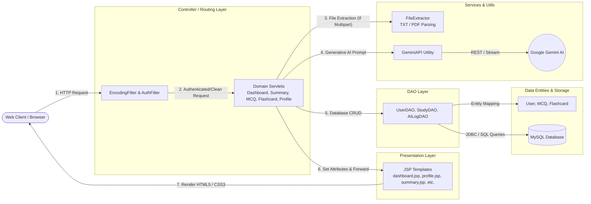
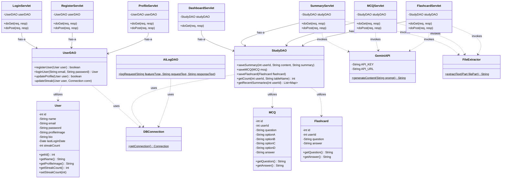
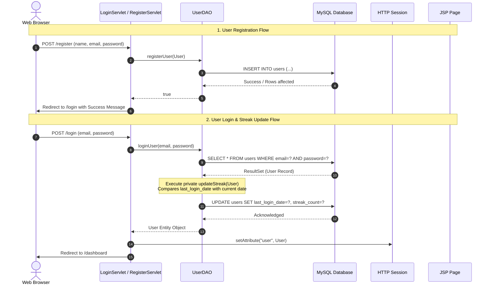
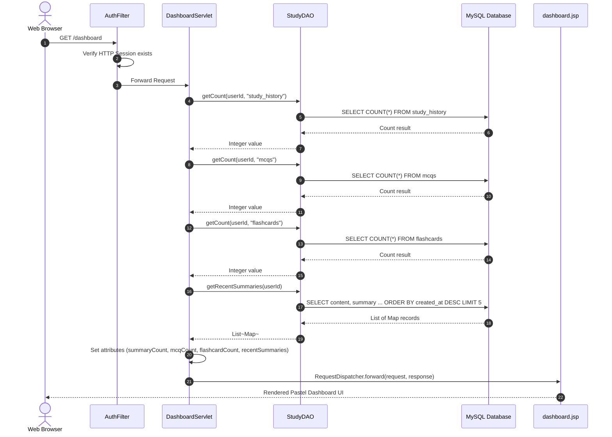
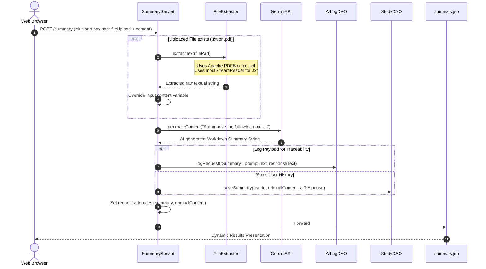
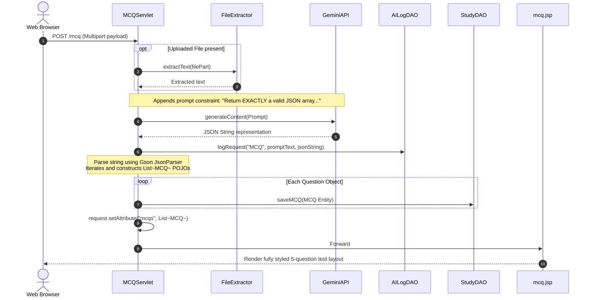
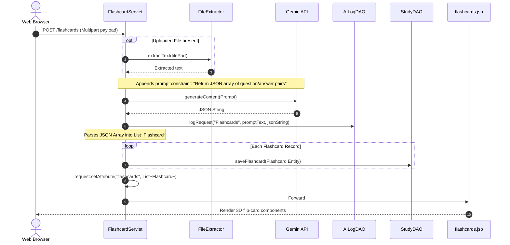
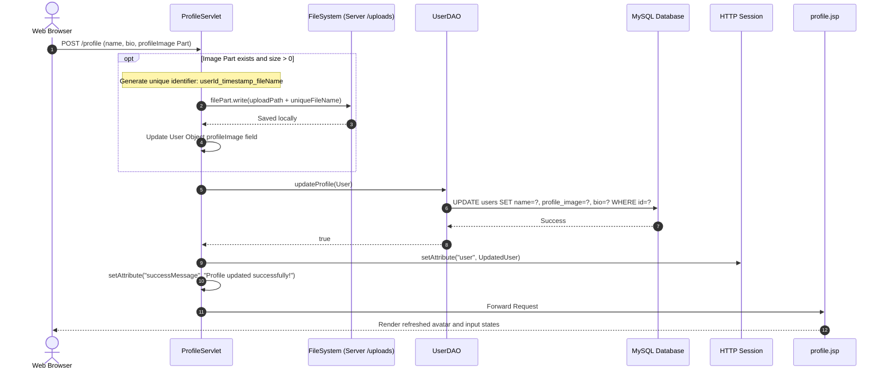

# Architecture & Flow Diagrams

This document illustrates the complete software architecture of the **AI Study Companion** application. It details the core **Model-View-Controller (MVC)** design pattern implementation, full static class structural relationships, and dynamic interaction sequences across all major user pathways.

---

## 1. High-Level MVC Design Pattern Flow

The application follows the classic Java EE **MVC (Model-View-Controller)** pattern where HTTP requests pass through standard lifecycle filters before reaching domain-specific Servlets (Controllers). The Servlets utilize Data Access Objects (DAOs) to interact with the relational MySQL Database (Models) and forward processed structures to JavaServer Pages (Views) for presentation.

---

## 2. Complete Class Diagram

Below is the structured representation of all classes present within the project packages (`com.aistudy.*`). It showcases inheritance, field compositions, and service calls.

---

## 3. Sequence Diagrams for Core Application Flows

### 3.1 Authentication Flow (Registration & Login)
Illustrates how users onboard, authenticate, and update consecutive study streaks.

---

### 3.2 Dashboard Loading Flow
Highlights how user history and statistical counts are aggregated dynamically upon loading the landing interface.

---

### 3.3 AI Summary Generation Flow (With File Upload Integration)
Demonstrates multi-format file extraction, external API invoking, and persistent payload logging.

---

### 3.4 AI MCQ Generation Flow
Demonstrates JSON structured responses mapped into domain POJOs.

---

### 3.5 AI Flashcard Generation Flow
Demonstrates extracting Q&A structures mapped to reactive CSS components.

---

### 3.6 User Profile Updating & Avatar Upload Flow
Traces uploading multipart image assets natively to the server context directory.

