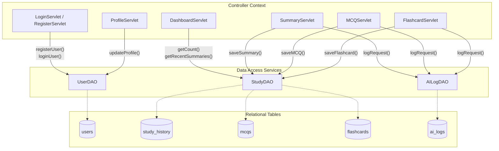
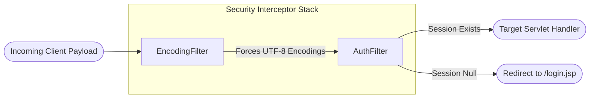

# Component Interactions & Controller-DAO Mapping

This document details the internal module interaction topology of the **AI Study Companion** platform. It demonstrates how HTTP controllers interface with dedicated storage access units, infrastructure helpers, and third-party web endpoints.

---

## 1. Controller to DAO Dependency Graph

The platform decouples request mapping from structural execution. Controllers hold references to stateless Data Access Objects (DAOs) initialized during early servlet engine instantiation phases (`init()` callbacks).

---

## 2. Infrastructure Flow Mapping

### 2.1 File Extraction Layer (`FileExtractor.java`)
Invoked dynamically across study endpoints when client requests present `multipart/form-data` MIME declarations containing active binary input streams.

*   **Consumers:** `SummaryServlet`, `MCQServlet`, `FlashcardServlet`
*   **Behavior:** 
    *   Inspects submitted file extension headers.
    *   If `.txt` is found: Instantiates standard Java stream buffering layers utilizing `UTF-8` character boundaries to rebuild text content.
    *   If `.pdf` is found: Passes streaming bytes into **Apache PDFBox**'s `PDDocument` unzipping structure, executing `PDFTextStripper` to strip text layouts cleanly.

### 2.2 External AI Connector (`GeminiAPI.java`)
Centralized communication wrapper wrapping HTTP connectivity layer constraints.

*   **Consumers:** `SummaryServlet`, `MCQServlet`, `FlashcardServlet`
*   **Behavior:**
    *   Pulls static external configurations (`AIza...` API keys) directly from `config.properties` resource bundles.
    *   Constructs valid JSON request blocks encapsulating text contexts.
    *   Establishes secure, outgoing REST API HTTP connections targeting Google Gemini public engine points (`https://generativelanguage.googleapis.com/...`).
    *   Extracts internal generative candidates natively prior to string hand-offs.

---

## 3. Filter Execution Matrix

Before any mapped controller path executes, traffic routes through pre-configured filtering wrappers ensuring uniform serialization and access security.

### 3.1 `EncodingFilter`
*   **Target Mapping:** `/*` (Global context traversal)
*   **Role:** Resolves character dropouts caused by parsing dynamic multi-byte character strings, ensuring all `request.setCharacterEncoding("UTF-8")` properties bind cleanly.

### 3.2 `AuthFilter`
*   **Target Mapping:** `/dashboard`, `/summary`, `/mcq`, `/flashcards`, `/profile`
*   **Role:** Validates runtime server sessions, ensuring unauthenticated external traffic cannot bypass root authorization constraints to read internal study material endpoints directly.
