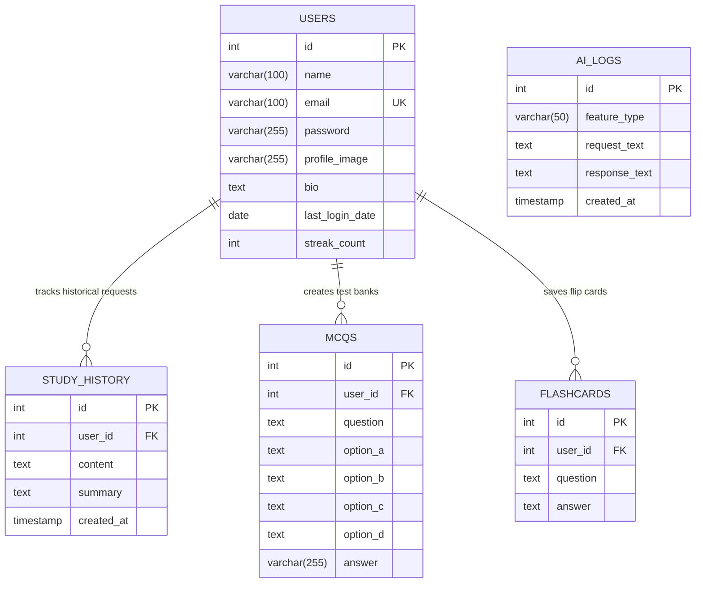

# Database Documentation & Mappings

This document outlines the schema design, structural definitions, foreign key integrity constraints, and Object-Relational Mappings (ORM) for the relational MySQL database utilized by the **AI Study Companion** application.

---

## 1. Entity-Relationship (ER) Diagram

The diagram below defines the structural tables and relational vectors within the `ai_study_companion` database schema. All domain child tables enforce explicit cascading delete metrics linked directly to parent accounts.

---

## 2. Table Schemas & Metadata Descriptions

### 2.1 `users` Table
Stores primary user identity records, hashed password credentials, ongoing authentication tracking, and custom profile branding configurations.

| Column Name | Data Type | Constraints / Attributes | Default Value | Description |
| :--- | :--- | :--- | :--- | :--- |
| **`id`** | `INT` | Primary Key, Auto Increment | *None* | Unique primary identifier for account records. |
| **`name`** | `VARCHAR(100)` | Nullable | *None* | Full display name of the registered user. |
| **`email`** | `VARCHAR(100)` | Unique, Non-Nullable | *None* | Authentication identity parameter. |
| **`password`** | `VARCHAR(255)` | Non-Nullable | *None* | Encrypted/hashed user security token. |
| **`profile_image`**| `VARCHAR(255)` | Nullable | `'default-avatar.png'` | Path identifier linking server context uploaded avatars. |
| **`bio`** | `TEXT` | Nullable | *None* | Custom markdown-friendly user personal overview. |
| **`last_login_date`**| `DATE` | Nullable | *None* | Timetracking snapshot capturing most recent authenticated date. |
| **`streak_count`** | `INT` | Nullable | `0` | Active counter summing total continuous daily session days. |

---

### 2.2 `study_history` Table
Captures textual user inputs alongside processed structural bullet points outputted by external language generators.

| Column Name | Data Type | Constraints / Attributes | Default Value | Description |
| :--- | :--- | :--- | :--- | :--- |
| **`id`** | `INT` | Primary Key, Auto Increment | *None* | Unique transaction block key. |
| **`user_id`** | `INT` | Foreign Key | *None* | References parent `users(id)` with `ON DELETE CASCADE`. |
| **`content`** | `TEXT` | Nullable | *None* | Original payload text string extracted from forms or file streams. |
| **`summary`** | `TEXT` | Nullable | *None* | Formatted markdown response synthesized by Gemini integration. |
| **`created_at`** | `TIMESTAMP`| Non-Nullable | `CURRENT_TIMESTAMP` | Static hardware timestamp recording task insertion boundary. |

---

### 2.3 `mcqs` Table
Stores generated multi-dimensional multiple choice arrays with verified correct matching vectors.

| Column Name | Data Type | Constraints / Attributes | Default Value | Description |
| :--- | :--- | :--- | :--- | :--- |
| **`id`** | `INT` | Primary Key, Auto Increment | *None* | Unique test item boundary key. |
| **`user_id`** | `INT` | Foreign Key | *None* | References parent `users(id)` with `ON DELETE CASCADE`. |
| **`question`** | `TEXT` | Nullable | *None* | Interrogative question prompt extracted from subject domains. |
| **`option_a`** | `TEXT` | Nullable | *None* | Distractor choice variable parameter. |
| **`option_b`** | `TEXT` | Nullable | *None* | Distractor choice variable parameter. |
| **`option_c`** | `TEXT` | Nullable | *None* | Distractor choice variable parameter. |
| **`option_d`** | `TEXT` | Nullable | *None* | Distractor choice variable parameter. |
| **`answer`** | `VARCHAR(255)`| Nullable | *None* | Validated correct answer selection matching distractor identifiers. |

---

### 2.4 `flashcards` Table
Maintains reactive review parameters focused on two-way active recall study logic.

| Column Name | Data Type | Constraints / Attributes | Default Value | Description |
| :--- | :--- | :--- | :--- | :--- |
| **`id`** | `INT` | Primary Key, Auto Increment | *None* | Unique item tracking code. |
| **`user_id`** | `INT` | Foreign Key | *None* | References parent `users(id)` with `ON DELETE CASCADE`. |
| **`question`** | `TEXT` | Nullable | *None* | Concise front-face concept target string. |
| **`answer`** | `TEXT` | Nullable | *None* | Detailed back-face explanation text payload. |

---

### 2.5 `ai_logs` Table
Decoupled traceability table engineered to safely capture raw JSON payloads and API telemetry independent of application domain constraints.

| Column Name | Data Type | Constraints / Attributes | Default Value | Description |
| :--- | :--- | :--- | :--- | :--- |
| **`id`** | `INT` | Primary Key, Auto Increment | *None* | Global diagnostics record pointer. |
| **`feature_type`** | `VARCHAR(50)`| Nullable | *None* | Feature routing tag (e.g., `'Summary'`, `'MCQ'`, `'Flashcards'`). |
| **`request_text`** | `TEXT` | Nullable | *None* | Complete outward context string payload dispatched to the model. |
| **`response_text`**| `TEXT` | Nullable | *None* | Complete raw JSON or streaming output returned by upstream APIs. |
| **`created_at`** | `TIMESTAMP`| Non-Nullable | `CURRENT_TIMESTAMP` | Explicit execution entry snapshot. |

---

## 3. Object-to-Table Class Mappings

The table below correlates backend models, executing Data Access Objects (DAOs), and related downstream consumer components to specific relational targets.

| Relational Table Target | Data Transfer Object (POJO) | Orchestrating Data Access Object | Primary Controllers / Servlets Utilizing Flow |
| :--- | :--- | :--- | :--- |
| **`users`** | `com.aistudy.model.User` | `com.aistudy.dao.UserDAO` | `LoginServlet`, `RegisterServlet`, `ProfileServlet` |
| **`study_history`** | *Decoupled / Primitive Map List* | `com.aistudy.dao.StudyDAO` | `SummaryServlet`, `DashboardServlet` |
| **`mcqs`** | `com.aistudy.model.MCQ` | `com.aistudy.dao.StudyDAO` | `MCQServlet`, `DashboardServlet` |
| **`flashcards`** | `com.aistudy.model.Flashcard` | `com.aistudy.dao.StudyDAO` | `FlashcardServlet`, `DashboardServlet` |
| **`ai_logs`** | *Stateless Infrastructure Log* | `com.aistudy.dao.AILogDAO` | `SummaryServlet`, `MCQServlet`, `FlashcardServlet` |
