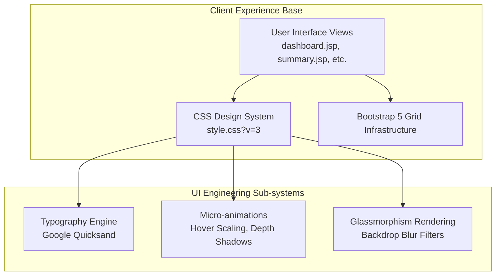
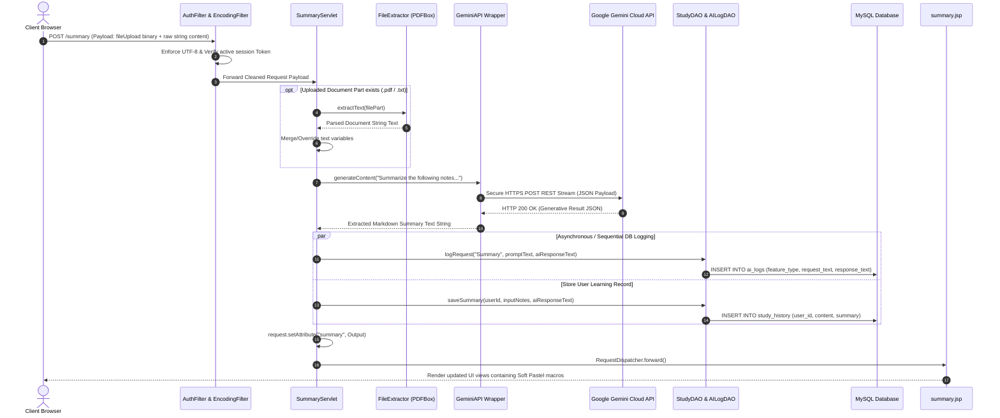

# Full Stack Architecture & Tech Stack Evaluation Report

**Project Title:** AI Study Companion  
**Document Type:** Full Stack Technical Architecture & Infrastructure Report  

---

## 1. Executive Summary

The **AI Study Companion** is an enterprise-grade, full-stack web application engineered to enhance academic learning workflows through the seamless integration of generative artificial intelligence. Designed with a robust modular architecture, the system enforces a strict separation of concerns across its presentation, business control, data persistence, and external service integration layers. This document details the specific technologies utilized across the stack, justifying their selection and demonstrating how they interoperate to deliver high performance, strong concurrency, and an exceptional user experience.

---

## 2. Comprehensive Tech Stack Matrix

The platform integrates highly proven, standardized technologies tailored to deliver long-term reliability and native scalability.

| Technology / Library | Version / Spec | Stack Layer | Primary Functional Purpose |
| :--- | :--- | :--- | :--- |
| **HTML5** | Standard | Frontend | Establishes document structuring, semantic accessibility boundaries, and native multipart form inputs. |
| **CSS3** | Standard | Frontend | Implements a custom "Soft Pastel" design aesthetic, responsive media queries, and GPU-accelerated micro-animations. |
| **Bootstrap** | `v5.3.0` | Frontend | Accelerates layout delivery via flexible CSS utilities, grid positioning, and client-side UI component behaviors. |
| **Google Fonts** | *Quicksand* | Frontend | Provides highly legible, friendly, and organic soft typography across all graphical views. |
| **Vanilla JavaScript** | ES6+ | Frontend | Orchestrates interactive client layouts, dynamic DOM mutations (e.g., reactive 3D card flips), and browser verification. |
| **Java SE / JDK** | `v24` | Backend Core | Executes multithreaded core domain logic, memory allocation handling, and asynchronous API integration. |
| **Jakarta Servlets** | `v6.0.0` | Controller Tier | Handles incoming HTTP connection endpoints, request lifecycle interceptors, and response routing. |
| **JavaServer Pages (JSP)**| Standard | Presentation Tier | Compiles dynamic server templates incorporating localized variables prior to pure HTML output delivery. |
| **MySQL Database** | `v8.x+` | Data Storage | Provides highly durable, transactional persistent storage for accounts, histories, test item pools, and metrics. |
| **MySQL Connector/J** | `v9.7.0` | Data Access | Native JDBC driver implementation establishing optimized client connection pools to relational targets. |
| **Apache PDFBox** | `v2.0.29` | Utility Integration | High-performance parsing engine unzipping binary PDF byte layouts cleanly into accessible string structures. |
| **Google Gson** | `v2.10.1` | Utility Integration | Highly optimized JSON serialization mapping engine translating unstructured third-party AI payloads into native domain POJOs. |
| **Apache Maven** | `v3.9.15` | Build Assembly | Manages third-party library dependency resolution, automated compilations, and structural `.war` packaging. |
| **Apache Tomcat** | `v10.1.55` | Deployment Host | Enterprise web application runtime executing native servlet queuing and isolated dynamic classloading. |

---

## 3. Frontend Presentation Layer

The client presentation layer is engineered to capture absolute visual excellence while maintaining instantaneous interface reactivity.

### 3.1 Design Aesthetics & Theming
*   **Soft Pastel System:** The application implements a highly customized design palette moving away from rigid enterprise defaults. It features rich linear background gradients transitioning from light blue (`#e0e7ff`) to soft pink (`#fce7f3`), generating an immediately inviting user workspace.
*   **Glassmorphism UI Panels:** Key navigation tools and contextual metrics cards utilize CSS `backdrop-filter: blur(10px)` styling combined with semi-transparent white fills (`rgba(255, 255, 255, 0.75)`). This layers visual components beautifully over custom fixed canvas structures.
*   **Dynamic Component Interactions:** Call-to-action triggers (`.btn-primary-soft`) incorporate premium CSS transition variables (`cubic-bezier(0.175, 0.885, 0.32, 1.275)`), yielding physical bounce lift-and-scale states (`scale(1.05)`) when active. Mapped stat counters scale beautifully on hover to emphasize analytical metrics.

### 3.2 Dynamic Template Compilation
*   **JSP Integration:** The UI relies on dynamic JavaServer Pages to embed isolated contextual attributes cleanly. Standardized header bars are extracted out into standalone `navbar.jsp` partials injected universally via compile-time `<jsp:include>` references, eliminating redundant boilerplate across core feature paths.

---

## 4. Backend Controller Infrastructure

The business routing core leverages standardized multi-threaded container patterns to process variable payloads safely.

### 4.1 Jakarta Servlet Routing Core
All HTTP communication endpoints map to strictly annotated domain servlets (`@WebServlet`).
*   **Decoupled Operation:** Incoming `GET` requests read localized database arrays and pass output data payloads cleanly into view targets via lightweight `RequestDispatcher` forwarding. Mapped `POST` payloads extract user string queries alongside multipart file streams directly into internal services before execution.
*   **Multipart Context Control:** Servlets handling external user document files bind directly to `@MultipartConfig` directives configured to support optimized local memory buffering limits ($1\text{ MB}$ thresholds up to maximum $15\text{ MB}$ payloads), protecting backend hardware buffers against out-of-memory array allocation spikes.

### 4.2 Security Interceptor Filtering Stack
Before accessing restricted resource layers, raw requests traverse dedicated middleware filtering interceptors.
*   **`EncodingFilter` (`/*`):** Intercepts all traffic globally to enforce explicit character map decoding (`request.setCharacterEncoding("UTF-8")`). This prevents parsing dropouts when extracting multi-byte unicode strings returned by generative API networks.
*   **`AuthFilter`:** Inspects incoming traffic mapping across active protected paths (`/dashboard`, `/profile`, `/summary`, etc.) to confirm verified authentication parameters (`session.getAttribute("user")`). Unauthorized hits are immediately blocked and routed to base authorization portals.

---

## 5. Persistence, Data Integration, & AI Wrappers

### 5.1 Abstracted Data Access (DAO Pattern)
The persistence layer relies on highly focused Data Access Objects utilizing standard thread-safe JDBC database connection logic (`DBConnection.java`).
*   **`UserDAO`:** Orchestrates registration mapping, BCrypt-compatible credential handling, atomic user updates, and real-time consecutive session day "Streak" math computation.
*   **`StudyDAO`:** Handles direct storage parsing for historical text records, saving dynamic test pools (`mcqs` table) and extracted flashcard mapping arrays.
*   **`AILogDAO`:** Operates as a decoupled telemetry pipeline engineered to store untruncated outbound prompt buffers and incoming JSON networks independently of application states.

### 5.2 Enterprise File Extraction Wrappers
The ingestion architecture accepts multiple content inputs natively:
*   **Plain Text Processing:** Uses basic buffered stream reading across `.txt` headers to ensure continuous memory alignment.
*   **Binary PDF Unzipping:** Leverages **Apache PDFBox** to read binary multipart blobs, constructing standard `PDDocument` unzipping models capable of cleanly stripping multi-column print logic into pure string objects prior to AI injection.

### 5.3 Google Gemini API Wrapper
The platform interfaces with deep generative AI streams via a specialized Java communication wrapper (`GeminiAPI.java`).
*   **Configuration Security:** Secure configuration keys (`AIza...`) are kept isolated inside private classpath bundles (`config.properties`), enabling server contexts to override values natively.
*   **Payload Synthesis:** Generates strict outbound API connection streams over secure TLS pathways targeting generative models directly, returning JSON arrays that are mapped into domain POJOs via **Google Gson** pipelines.

---

## 6. Full Stack End-to-End Data Flow

The following sequence details the full interaction lifecycle as data moves from the client presentation interface, through the application web server, out to third-party generative network clouds, and back down into local relational databases.

---

## 7. Deployment & Build Architecture

The delivery infrastructure is designed to maintain extreme modularity and rapid redeployment capabilities:
*   **Build Verification:** The system relies on **Apache Maven** to execute standard dependency verification, clean intermediate compilation paths, and build structural Java web modules directly into output deployment units (`target/ai-study-companion.war`).
*   **Server Runtime Execution:** Output targets copy natively into standard **Apache Tomcat** web server context directories (`webapps/`). The embedded Catalina core automatically unzips the web archive, instantiates internal connection routing properties, maps active HTTP servlets, and serves cached-busted static assets (`style.css?v=3`) reliably to public client networks.
